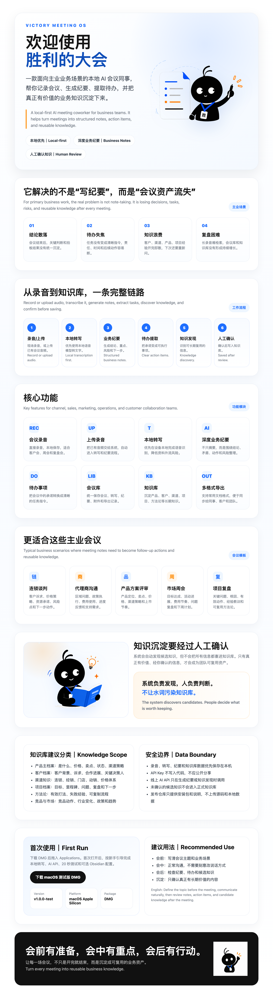

# 胜利的大会｜Victory Meeting

> 你的本地 AI 会议同事。  
> Your local AI meeting coworker.

## 一句话介绍｜One-liner

**胜利的大会**是一款面向业务团队的本地 AI 会议纪要工具，帮助渠道、销售、市场和客户协作团队把会议录音转成可复用的业务资产。

**Victory Meeting** is a local-first AI meeting assistant for business teams. It turns meeting recordings into structured notes, action items, and reusable knowledge.

## 适合谁使用｜Who It Is For

- 渠道营销经理、省区/大区负责人
- 代理商、经销商、连锁客户沟通团队
- 市场、销售、运营、项目推进团队
- 需要沉淀客户、产品、渠道、项目知识的团队

English:

- Channel marketing managers and regional teams
- Distributor, dealer, and retail-chain collaboration teams
- Marketing, sales, operations, and project teams
- Teams that need to retain customer, product, channel, and project knowledge

## 它解决什么问题｜Problems It Solves

- 会开完了，但结论、任务和风险没有被真正留下来
- 长录音难以复盘，关键信息容易散落在不同聊天和文档里
- 待办事项没有形成清晰指令，后续推进容易断档
- 客户、产品、渠道、方法论等知识没有持续积累

English:

- Meeting conclusions, tasks, and risks are often lost after the meeting
- Long recordings are hard to review and key information gets scattered
- Action items are not written as clear instructions
- Business knowledge is not continuously accumulated

## 核心流程｜Core Workflow

1. **录音或上传音频**  
   Record a meeting or upload an existing audio file.

2. **本地转写**  
   Convert speech to text locally when the local model is enabled.

3. **生成深度业务纪要**  
   Generate structured business notes with conclusions, discussion points, risks, and next steps.

4. **提取待办事项**  
   Turn meeting commitments into clear task-style instructions.

5. **发现可沉淀知识**  
   Identify valuable customer, product, channel, project, and methodology knowledge.

6. **人工确认后进入知识库**  
   New knowledge is saved only after human confirmation.

## 主要功能｜Key Features

- **会议录音**：支持直接录音，会议文件优先保存在本机。
- **上传录音**：支持上传已有会议音频，生成转写和纪要。
- **深度业务纪要**：按业务场景整理结论、重点、行动项、风险和下一步建议。
- **待办事项**：从会议中提取明确、可执行的事项。
- **会议库**：统一管理历史会议、转写、纪要和附件。
- **知识库**：沉淀客户、产品、渠道、项目、竞品、政策、方法论等长期知识。
- **人工确认**：系统先发现候选知识，经确认后才写入知识库。
- **多格式导出**：支持常用文档格式导出，方便同步给同事、客户或团队。

English:

- **Recording**: Record meetings and store files locally first.
- **Audio upload**: Upload existing audio files for transcription and notes.
- **Business notes**: Generate structured conclusions, key points, actions, risks, and next steps.
- **Action items**: Extract clear and executable tasks.
- **Meeting library**: Manage meeting history, transcripts, notes, and files.
- **Knowledge base**: Retain reusable business knowledge across customers, products, channels, projects, competitors, policies, and methods.
- **Human confirmation**: Candidate knowledge is saved only after review.
- **Export**: Export notes into common document formats for team sharing.

## 典型主业场景｜Business Scenarios

- **连锁谈判**：沉淀客户诉求、价格策略、资源承诺、风险点和下一步动作。
- **代理商沟通**：记录区域问题、政策执行、进度反馈和需要总部支持的事项。
- **产品方案评审**：整理产品定位、卖点、价格、渠道策略和上市节奏。
- **市场周会**：复盘目标达成、费用使用、活动进展和下周计划。
- **项目复盘**：保留关键问题、根因、有效动作和可复用方法论。

English:

- **Retail-chain negotiation**: Capture customer needs, pricing logic, resource commitments, risks, and follow-ups.
- **Distributor meetings**: Record regional issues, policy execution, progress, and support needs.
- **Product review**: Summarize positioning, selling points, pricing, channel strategy, and launch rhythm.
- **Market weekly meetings**: Review targets, spending, activities, and next-week plans.
- **Project retrospectives**: Retain issues, root causes, effective actions, and reusable methods.

## 数据边界｜Data Boundary

- 录音、转写、纪要和知识库数据优先保存在本机。
- API Key 不写入代码，不应公开分享。
- 如配置线上 AI API，系统只在生成纪要或知识发现时调用相关接口。
- 未经人工确认的候选知识不会进入正式知识库。

English:

- Recordings, transcripts, notes, and knowledge data are stored locally first.
- API keys are not hard-coded and should not be shared publicly.
- Online AI APIs are called only when configured and needed for summary or knowledge discovery.
- Candidate knowledge is not saved into the formal knowledge base without human confirmation.

## 安装方式｜Installation

请到 GitHub Release 下载测试版 DMG：

[下载 macOS 测试版 DMG](https://github.com/zhangchunquan298-anhui/shengli-dahui/releases/download/v1.0.0-test/VictoryMeeting-1.0.0-arm64.dmg)

安装后首次打开，按新手引导完成：

1. 检查本地转写环境
2. 配置 DeepSeek 或其他兼容 API
3. 做一次 20 秒测试录音
4. 按需配置 Obsidian 知识库

English:

Download the macOS test DMG from GitHub Releases, install it, and complete the first-run guide: local transcription check, AI API configuration, 20-second test recording, and optional Obsidian setup.

## 当前版本｜Current Version

- Version: `v1.0.0-test`
- Platform: macOS Apple Silicon
- Package: `VictoryMeeting-1.0.0-arm64.dmg`

## 使用建议｜Recommended Usage

会前明确主题，会中正常沟通，会后检查纪要、待办和候选知识。真正有价值的信息，经人工确认后再进入知识库。

Before a meeting, define the topic. During the meeting, communicate naturally. After the meeting, review notes, action items, and candidate knowledge before saving valuable information into the knowledge base.

